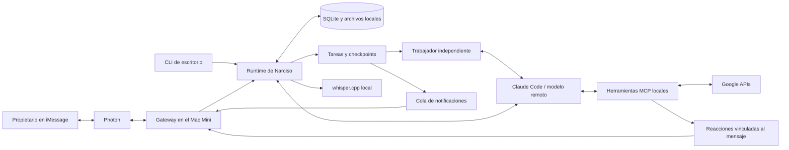

# Narciso

**Un clon personal de Instinct, implementado desde cero para correr en tu Mac Mini.**
Un asistente para una sola persona, con personalidad, memoria, iniciativa y
conversación por iMessage. Inspirado en la experiencia de Instinct; proyecto
independiente, sin afiliación ni código de Instinct.

La idea: un asistente que entienda tu contexto y proponga acciones concretas,
con un entorno que puedas abrir, inspeccionar y controlar tú mismo.

**Local no significa offline:** el servicio, el estado, los archivos y la
transcripción de audio viven en el Mac. Claude procesa el modelo en remoto a
través de Claude Code; Photon conecta iMessage y Google aporta sus APIs.
El control del navegador local todavía está pendiente.

## Lo que ya hicimos

1. **Servicio en el Mac Mini.** Proceso supervisado por `launchd`, reinicio
   después de fallos y bloqueo para evitar dos consumidores de Photon.
2. **iMessage con Photon.** Conversación bidireccional, un único remitente
   autorizado, cola de tareas, historial persistente y detección de duplicados.
3. **Claude Code con suscripción.** Usa el CLI oficial con la sesión del
   propietario. Sin extraer credenciales OAuth, sin API key y sin fallback
   automático a llamadas de API de pago. Aplican los límites de la cuenta.
4. **Personalidad y contexto.** [SOUL.md](SOUL.md) define tono, iniciativa y
   límites. [CONTEXT.example.md](CONTEXT.example.md) es la plantilla del contexto
   privado. Memoria de preferencias confirmadas, con su fuente.
5. **Google personal.** Gmail: buscar, leer, preparar borradores, enviar y
   archivar. Calendar: listar calendarios/eventos y crear eventos. Tasks:
   listar, crear y completar. Drive: buscar. Docs: leer, crear y añadir texto.
   Sheets: leer, crear y escribir valores.
6. **Cambios con aprobación.** Las operaciones de escritura se preparan con
   su payload real. Solo un mensaje escrito `approve CODE` las ejecuta; el
   código está vinculado a la conversación, caduca y no se puede reutilizar.
7. **Confirmación de lectura.** Marca el mensaje como leído después de guardar
   su recepción, incluso cuando otra tarea sigue en curso.
8. **Respuestas limpias.** Solo envía el campo final validado de la respuesta.
   Eventos de razonamiento que exponga Claude, herramientas y errores quedan
   en diagnósticos locales; no se envían a iMessage como narración interna.
9. **Imágenes y screenshots.** JPEG, PNG, HEIC/HEIF, WebP y primer frame de GIF;
   captions y hasta cuatro imágenes por mensaje. Conserva imágenes recientes
   para preguntas de seguimiento. Máximo 25 MiB por archivo.
10. **Notas de voz.** Transcripción local con whisper.cpp y ffmpeg, inglés y
    español, hasta cinco minutos. Fallback de idioma para audios cortos y
    vocabulario configurable. Las respuestas siguen siendo texto.
11. **Reacciones nativas.** 👀 al revisar Google, 👍 al preparar o empezar un
    cambio aprobado, y ocasionalmente ❤️, 😂, 🎉 o 💪 según el contexto.
    Máximo una reacción por mensaje; nunca significa que la tarea terminó.
12. **CLI de escritorio y diagnóstico.** Conversación desde terminal, comando
    `doctor`, trazas privadas con retención limitada y 30 pruebas automatizadas.

13. **Tareas independientes.** Narciso decide cuándo delegar una investigación
    y acusa su recepción. Un trabajador de fondo continúa con su propio contexto
    y checkpoints mientras el chat responde otras preguntas. Permite consultar
    estado, añadir aclaraciones, cancelar y retomar una tarea bloqueada.
14. **Cobertura verificable de Gmail.** Paginación, rangos del día según la zona
    horaria y conteos de IDs únicos. Distingue mensajes encontrados, resúmenes
    consultados y cuerpos leídos; una revisión con páginas o resúmenes pendientes
    no puede terminar con estado `completed`.

Probado en una instalación personal de Apple Silicon: acceso de lectura a los
seis servicios de Google, iMessage completo, lectura antes de la respuesta,
imágenes, voz en inglés/español y reacciones visibles antes de responder.
Las pruebas automatizadas no realizan cambios en una cuenta real de Google;
la cobertura de escritura contra servicios reales sigue pendiente.

## To-Do por fases

1. **Navegador local:** sesiones persistentes, perfiles separados y toma de
   control humana para login, MFA o CAPTCHA; continuar la tarea tras el relevo.
2. **Acciones completas:** investigar facturas, cancelaciones y reembolsos;
   preparar pagos con sus datos verificables y aprobación explícita.
3. **Proactividad persistente:** recordatorios, seguimientos, revisión de correo
   y alertas útiles que sobrevivan a reinicios, con horarios de silencio.
4. **Más cuentas y contexto:** Google Workspace y correo empresarial, con
   separación de identidades, permisos, memoria y sesiones.
5. **Google más completo:** limpieza por lotes, filtros, bajas de suscripciones,
   más operaciones de Calendar, formato de Docs y gráficos de Sheets.
6. **Mejor experiencia y recuperación:** panel de escritorio, tareas en curso,
   controles de memoria, recuperación guiada de tareas interrumpidas, PDFs,
   mejoras de transcripción y respuestas de voz opcionales.

El detalle y los criterios de cada fase están en [TODO.md](TODO.md).
No están implementadas las tareas pendientes por el hecho de estar en esta lista.

## Cómo funciona



## Instalación

Pensado inicialmente para **macOS en Apple Silicon**, Node.js 24+, Python 3,
Claude Code instalado y autenticado, una cuenta de Photon con iMessage y un
cliente OAuth de Google de tipo **Desktop app**.

```sh
git clone https://github.com/danglade/narciso.git
cd narciso
npm ci --ignore-scripts
cp .env.example .env
cp CONTEXT.example.md CONTEXT.md
chmod 600 .env CONTEXT.md
```

Edita `.env` con el teléfono del **propietario que envía mensajes**, no el
número del asistente, su Gmail, zona horaria y credenciales de Photon.
Personaliza `CONTEXT.md` con tus preferencias. Ambos archivos quedan fuera de Git.

Habilita Gmail, Calendar, Tasks, Drive, Docs y Sheets en tu proyecto de Google.
Guarda el JSON OAuth en `~/.local/share/narciso/data/google-client.json`.

```sh
mkdir -p ~/.local/share/narciso/data
chmod 700 ~/.local/share/narciso/data
# Coloca google-client.json en ese directorio y aplica chmod 600 al archivo.
npm run google:login
npm run doctor
npm test
npm run chat -- '¿Qué tengo mañana en el calendario?'
```

El consentimiento se abre en el navegador del Mac. El callback local verifica
el estado OAuth y la identidad exacta del Gmail configurado. Un proyecto OAuth
externo que permanezca en modo Testing puede exigir reautorización periódica.

Para voz, instala las dependencias locales:

```sh
brew install whisper-cpp ffmpeg
mkdir -p ~/.local/share/narciso/data/models
```

Descarga [ggml-small.bin](https://huggingface.co/ggerganov/whisper.cpp/resolve/main/ggml-small.bin)
a ese directorio. SHA256 esperado:
`1be3a9b2063867b937e64e2ec7483364a79917e157fa98c5d94b5c1fffea987b`.
Puedes configurar `NARCISO_WHISPER_MODEL`, `NARCISO_WHISPER_BIN`,
`NARCISO_FFMPEG_BIN`, `NARCISO_SPEECH_VOCABULARY` y `NARCISO_SPEECH_FALLBACK`.
Las imágenes se convierten con `sips`, incluido en macOS.

Inicia el gateway en primer plano o instala el servicio:

```sh
npm start
# Detén el proceso anterior antes de instalar el servicio.
python3 scripts/install-service.py
launchctl print gui/$(id -u)/ai.narciso.gateway
```

La opción `--take-over-hermes` detiene y deshabilita el servicio de Hermes
existente para reutilizar su conexión de Photon. Úsala solo si quieres esa
migración; conserva sus archivos. No ejecutes ambos contra la misma conexión.

El instalador copia la aplicación a `~/.local/share/narciso/app`, fuera de
Documents, y mantiene sus datos aparte. Vuelve a ejecutarlo para desplegar
cambios cuando no haya una tarea activa. El servicio requiere que el usuario
de macOS haya iniciado sesión; no funciona durante la pantalla de desbloqueo
FileVault posterior a un reinicio.

## Conversación y tareas de fondo

Para una revisión amplia, puedes decir «Revisa los correos de hoy y dime qué
merece atención». Narciso decide usar una tarea y devuelve un acuse natural,
sin identificadores internos. Después puedes hacerle otra pregunta, pedir el estado, aclarar
«solo los de ayer» o cancelar la revisión. Una pregunta nueva no cancela la
anterior. La elección de delegar usa el modelo; no hay una demora artificial.

El gateway mantiene la conversación separada de un trabajador de investigación.
Máximo tres tareas pendientes/activas y un trabajador de fondo, además del chat.
Cada segmento de Claude tiene un límite de tres minutos; el trabajo puede
continuar desde un checkpoint durante hasta 18 ejecuciones antes de quedar
bloqueado y pedir intervención. No es un scheduler para recordatorios futuros.

El trabajador usa herramientas de lectura. No puede ejecutar ni preparar
escrituras, cambiar memoria, crear tareas anidadas o reaccionar a otro mensaje.
Las acciones de Google conservan el flujo de aprobación en la conversación.
El acuse debe quedar entregado antes de que arranque la investigación.

Los resultados y bloqueos se guardan en una cola persistente de notificaciones.
Puede enviar hasta dos hallazgos intermedios relevantes, separados al menos un
minuto; no envía informes rutinarios de progreso ni razonamiento interno.
Las lecturas interrumpidas se retoman desde el último checkpoint al reiniciar;
un envío ambiguo se conserva como `needs_review` sin repetirlo automáticamente.

En Gmail se enumeran los mensajes reales, incluidos archivados y etiquetas
personalizadas, pero excluyendo Spam y Papelera. Luego se consultan lotes de
asuntos/resúmenes y se amplía el cuerpo de mensajes relevantes. El resultado
incluye cobertura calculada por el runtime. Los resúmenes de SaneBox cuentan
como un correo; lo que mencionan no se presenta como leído individualmente.
El contador de mensajes no significa que todos los cuerpos o adjuntos se hayan
leído. La paginación de Google no es un snapshot atómico del buzón.

## Datos, límites y recuperación

- Estado privado: `~/.local/share/narciso/data`. No se publica con el código.
- Trazas: `data/traces`, archivos 0600, hasta siete días y aproximadamente
  100 MiB; máximo 5 MiB por turno. Pueden contener información privada de Google.
- Media: `data/media`, carpetas privadas, hasta siete días y aproximadamente
  500 MiB, protegiendo la última hora. La limpieza ocurre al recibir nueva media.
  Los transcripts permanecen en el historial; los bytes no entran en las trazas.
- Claude recibe las imágenes y el texto relevante; el audio se transcribe en
  el Mac. No es un sistema completamente offline.
- El recibo de lectura confirma recepción persistida, no descarga completa ni
  ejecución. Una reacción también es solo un acuse o gesto.
- Una operación de escritura interrumpida o un envío ambiguo queda en
  `needs_review`; no se repite automáticamente. La recuperación guiada es parte del roadmap.
- El modelo no tiene shell, navegador ni servidores MCP heredados. Las
  escrituras de Google pasan por la aprobación del runtime. Documentos,
  screenshots y contenido externo no conceden permisos.
- Es una implementación personal en evolución; no tiene paridad completa
  con Instinct ni onboarding o aislamiento para múltiples usuarios.

## Referencias

- [Claude Code con una suscripción de Claude](https://support.claude.com/en/articles/15036540-use-the-claude-agent-sdk-with-your-claude-plan)
- [Entrada de imágenes en Claude Code](https://code.claude.com/docs/en/agent-sdk/streaming-vs-single-mode)
- [Photon Spectrum SDK](https://github.com/photon-hq/spectrum-ts)
- [whisper.cpp](https://github.com/ggml-org/whisper.cpp)
