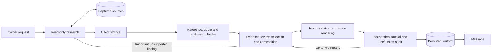

# Evidence, selection and publication

Narciso publishes a decision-oriented message rather than forwarding the
researcher's working notes. The first implementation used three model calls
(review, editor, audit). It still repeated incidental details and generic caveats.
The current implementation combines evidence review and composition, followed by
an independent audit. Selection and next actions are explicit structured data.

## Why two model passes

The composer reads the captured evidence, judges candidate findings and selects
what the owner needs to know. Its support verdicts are provisional: the auditor
sees the original evidence and omissions too, not just an approved-looking draft.
Both calls have no tools, hooks, conversation history or persistent model session.
Combining review and writing removes one normal model call; it also means the
writer sees raw source text. Source text remains untrusted data and the final
audit is a separate context. This is a tradeoff, not stronger semantic isolation.

Research retains the task model/effort, currently Opus 5/xhigh. Publication uses
the same model with `NARCISO_PUBLICATION_EFFORT=high` by default. The setting is
configurable. Fewer calls and lower effort do not guarantee a fixed token or
latency saving: packet size, repairs and provider load matter.

## Evidence and calculations

Successful reads are captured under task-bound IDs in SQLite, with tool, reading
level, truncation flag and calculation dependencies. Quotes must appear in the
captured text after whitespace normalization. Missing sources, invented quotes
and cross-task references are rejected in code. Packets are bounded to 200,000
characters; larger packets return to research for narrower selection.

Sourced sums use integer cents, quotes containing an amount and transaction
identifier, and duplicate-identifier rejection. These checks do not prove that
extraction is semantically correct, different IDs represent different payments,
currency was inferred correctly, or a payment settled. A bank email remains a
reported observation, not independent verification of the bank account.

## Selection and omission

Each finding receives a support verdict plus a disposition: include, duplicate,
routine, out of scope, lower priority, or unsupported. Reasons remain private.
Rejected relevant facts return to research; low-priority unsupported speculation
may be omitted. All supported high-importance findings must be represented;
related ones can share a paragraph. Their incidental details need not be copied.
The audit checks for omitted consequential facts even when their original
importance was not marked high.

Default summaries aim for 60–110 words, capped at 160 including the next action,
with at most 45 words per topic paragraph. Explicit requests for detail can use
250 words and retain requested IPs/times. The auditor checks that this exception
matches the actual owner request. The host rejects summary IPs/clock times,
known authentication codes in findings, task/source IDs, basic numerical drift,
missing topic references and selected generic process/proof disclaimers.
These are targeted checks, not a complete linguistic or secret-detection system.

Material uncertainty stays: for example, a notice does not establish who logged
in or why a workflow failed. Generic explanations of what email cannot prove
should not displace useful findings. The host adds the existing short mail-scope
note after publication, outside the message word budget.

## Next actions are data, not arbitrary promises

`src/next-actions.mjs` supplies an action catalog derived from available read
tools, plus conversational actions. The composer chooses at most one action and
binds it to included findings with literal service/person/topic labels. The host
renders it beside the relevant paragraph. The audit checks the target and whether
this is the useful next step, not a repeat of already completed research.

Available proposals: ask whether an access is recognized; inspect related mail;
prepare a reply in chat; check calendar availability; read an identified Google
document. `none` is valid when no follow-up is useful. Routine receipts should not
end with a manufactured question. Unknown services can use a generic recognition
question rather than treating “unknown device” as a service name.

There are no payment, browser, account-change or scheduled-follow-up actions in
this catalog. A proposal never executes an action. An accepted proposal returns
to foreground conversation and the normal tool/approval flow. Catalog availability
reflects installed capabilities, not a guarantee that remote authorization is
still valid. Actual tool calls check their connection as usual.

## Durability, budget and control

- `task_evidence`: private source observations.
- `task_research`: completed or partial candidate findings.
- `task_artifacts`: composition and audit outputs keyed by evidence, objective,
  owner updates, policies, schemas, capabilities and model configuration. Each
  audit is also keyed by its exact rendered message, including host action text.
- `task_stage_metrics`: model-stage elapsed milliseconds and input character
  counts; this is not a token billing meter.

Unchanged completed stages are reusable after interruption; changed inputs
invalidate the cache. Required incomplete Gmail pages are passed explicitly to
research, including auxiliary searches. Candidate findings survive corrections.

The normal publication path is two calls. Up to two repairs are allowed; exhausted
publication blocks rather than restarting Google research. Research and publication
share 36 model calls per task, an 18-research-segment limit and per-call timeout.
Explicitly resuming a blocked task resets the budget; automatic retries do not.
Cancellation and new owner clarifications prevent stale publication.

Intermediate important findings use the same pipeline. Raw researcher text cannot
be sent through `task_notify`. The existing two-update cap, persistent outbox and
ambiguous-delivery handling remain. A failed verification sends a bounded status
message, not the unverified result.

## Verification and remaining limits

`npm test` checks source binding, arithmetic, selected/omitted references, action
availability/rendering, budgets, stage recovery, cancellation and clarification
races. Mocks verify control flow, not the quality of the model's judgment.

`node --env-file-if-exists=.env scripts/evaluate-publication.mjs` runs the fixed
eight source-interpretation cases with the actual composer and a full supported
publication. `scripts/evaluate-experience.mjs` tests mixed inbox priorities,
invoices, reply proposals, routine receipts and explicitly requested detail.
Both consume Claude quota but use synthetic data and no Google/Photon calls.
The experience evaluator accepts `--baseline` to compare the same mixed packet
with frozen commit `ba90f6f`, and `--output PATH` for a report. Optional environment
variable `NARCISO_EVAL_CASE` selects one fixture. No private corpus is committed.

The final semantic and usefulness audit is probabilistic; the same model family
can share blind spots. Correctly quoting a source does not authenticate it.
Numerical checks are lexical and incomplete. An omission reason is not proof that
omission was wise. Fixed examples and measured runs are evidence about those
runs, not guarantees for every future request.

This pipeline covers background results and intermediate findings. Ordinary
foreground reformulations still have a separate reply contract. Retention of
SQLite evidence/artifacts is pending; trace expiry does not delete those records.
A provider-independent verifier or external work queue may be useful later if
measured accuracy, throughput or fault-isolation needs justify the extra cost.
