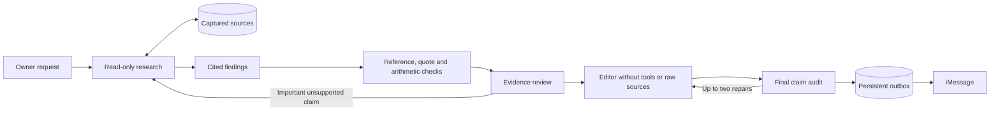

# Evidence and publication pipeline

Narciso previously let the investigating model write the final message directly.
That allowed a correct list of emails to become unsupported reassurance or causal
claims. Background results now pass through separate, durable stages.

## Trust boundaries

The researcher can read the connected Google account. Successful reads are
captured under task-bound source IDs in SQLite. A source records only the text
actually returned to the model, its tool, reading level, truncation flag, and
calculation dependencies. Publication packets are bounded to 200,000 characters;
oversized packets return to research for narrower selection. These records are private data, not repository files.

A finding contains an atomic statement, category, importance, reported/inference
classification, uncertainty, exact quotes and source IDs. Quotes must occur in
the captured source (whitespace normalization only). References to another task,
missing sources and invented quotes are rejected before another model runs.

Sourced sums require a quote containing the amount and a transaction identifier.
The host uses integer cents and rejects duplicate transaction identifiers. This
checks arithmetic and the presence of input values, not whether an extraction is
semantically correct, two different identifiers describe the same transaction,
a currency was inferred correctly, or a payment has settled. Evidence review must
check those meanings; a bank email remains a bank email, not a bank reconciliation.

The evidence reviewer sees the cited source packet in a fresh Claude invocation.
It approves or rejects each finding. Rejected relevant facts return to research, even when their importance was not
marked high; low-priority unsupported speculation can be omitted. The reviewer cannot silently
rewrite an unsupported claim into an approved one.

The editor receives approved findings and uncertainties, language and the owner
objective. It receives neither raw mail nor conversation history. All publication
stages run with an empty MCP configuration, no built-in execution tools, no hooks,
and no session persistence. Only the investigator gets Google tools.

The editor associates each paragraph with approved finding IDs. The host rejects
unknown references, missing high-importance findings, internal IDs, reasoning tags,
numbers absent from the paragraph's approved findings, dropped explicit timezone
labels on clock times, and summaries over 250 words. A separate final audit
then checks implications, certainty, relationships and actions against evidence.
At most two editorial repairs are attempted for a source packet. An exhausted editorial stage blocks publication instead of repeating Google research. An unapproved
message cannot enter the completed-result outbox.

## Durability and owner control

`task_evidence` stores sources. `task_research` stores completed research.
`task_artifacts` stores each review, draft and audit keyed by the full packet,
including owner clarifications, stage policies/schemas and model configuration. Prior candidate findings survive correction cycles; required missing review calls
are provided explicitly to prevent repeated premature completion. Unchanged completed stages can be reused after
restarts; changed evidence or instructions invalidate that cache.

Cancellation stops active work and prevents publication. Owner clarifications
arriving during editing invalidate the old response. Intermediate important
findings use the same publication path: a research segment returns `continue`,
`notify: true`, and cited findings. Raw `task_notify` prose cannot be sent.
Research and publication share a durable limit of 36 model calls per task, in addition
to the 18 research-segment limit and per-call timeout. Explicitly resuming a blocked
task resets that budget; automatic retries do not. The existing two-update limit and ambiguous-delivery handling remain in force.

`reply` from the investigator is private working text. It is never used as the
final message. If research is blocked or verification exhausts its budget, the
host sends a bounded status message, not the unverified draft. Mail reading limits
are appended in plain language; detailed counts remain available in diagnostics.

## What this does and does not guarantee

Deterministic guarantees: task/source binding, quote membership, decimal
arithmetic, transaction-ID deduplication, stage schemas, basic numerical
consistency, absence of tools for publication stages, and no publication before
required stages pass.

Semantic review is still probabilistic. The same model family may share blind
spots across stages. A false claim in an email may be accurately quoted; the
source itself is not independently authenticated by this pipeline. Number checks
cannot catch every number written in words or every misleading implication.
These checks reduce known failure modes; they do not prove every final sentence.

This path covers background investigations and their intermediate findings.
Ordinary foreground conversation still uses its own reply contract. Rephrasing
an old result in foreground chat is not yet subjected to this full pipeline.
Source retention needs its own policy; existing trace retention does not expire
SQLite evidence automatically.

## Evaluation

`npm test` exercises reference isolation, invented quotes, exact sums, editor
number changes, audit rejection, cancellation, clarification races and restart
recovery. These are deterministic control-path tests, not model quality scores.

`node scripts/evaluate-publication.mjs` is an explicit, subscription-consuming
model evaluation. Its fixed synthetic cases reproduce observed failure patterns:
login/charge inference, memo majorities, incomplete contracts, operational
causality, fabricated recruiter urgency, overgeneralized IP clusters and omitted
contract exceptions. It also includes a valid alert and
runs that supported finding through editing and final audit. It sends no messages
and does not access Google. Passing these cases is evidence about that run, not
a universal accuracy guarantee. Keep these fixed when changing prompts or models.

A more elaborate service architecture (separate workers, durable external queue,
independent verifier provider) can preserve these same contracts. For one owner
on one Mac, SQLite and isolated subprocesses keep operations manageable; migration
is warranted when throughput, failure isolation or independent model evaluation
requires it, not simply to add more agents.
